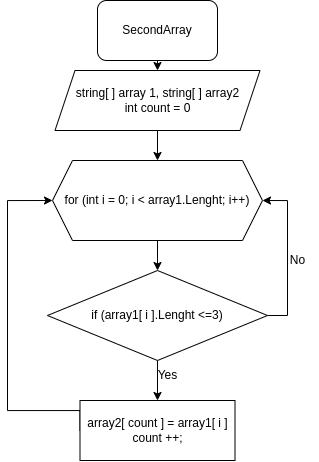

# Итоговая проверочная работа

## Задание
Написать программу, которая из имеющегося массива строк формирует 
массив из строк, длинна которых меньше либо равна 3 символа. 
Первоначальный массив можно ввести с клавиатуры, либо задать на старте выполнения алгоритма. 
При решении не рекомендуется пользоваться коллекциями, лучше обойтись исключительно массивами.
##  Примеры массивов
* "hello", "2", "world", ":-)"
* "1234", "1567", "-2", "computer science"
* "Russia", "Denmark", "Kazan"

## Описание алгоритма решения:

1. Объявленно два string массива:
* Заданный массив из примеров массива array1;
* Пустой массив такой же длинны array2;
2. Создан Void метод SecondArray принимающий на вход ранее обьявленные массивы. 
3. Объявленна переменная count с значением 0.
4. Обявлен цикл for с условием переменная i=0, меньше длинны заданного массива, переменая  i + 1.
5. Внутри цикла for объявленно условие if при котором если длинна элемента с индексом из цикла for меньше или равна 3, елемент первого массива присваивается элементу второго массива с индексом count. После чего переменная count увеличивается на 1.
6. Далее цикл for выполняется до превышения переменной i длинны массива array1.
6. Создан стандартный метод PrintArray для вывода массива array2.

## Блок-схема метода SecondArray

